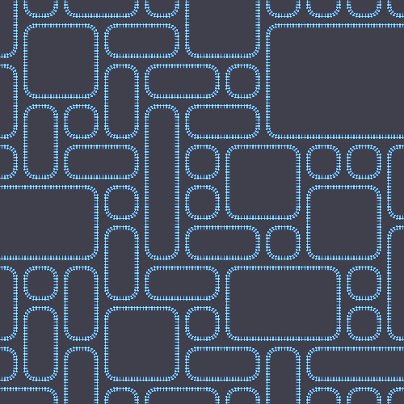

# Wave Function Collapse

A simple implementation of `wave function collapse` written in c++

## Requirements

- cmake
- make
- gcc with c++11 support
- libgd with png support

## Building

```shell
cmake . -DCMAKE_CXX_FLAGS="-s"
make
```

### Usage

`./waveformgen`

You can tinker around (in main.cpp) with the following values to get different resolutions:

`canvasRows` - Grid Row count
`canvasColumns` - Grid Column count

Resolution of each tile:
`tileResolutionX, tileResolutionY`

A local benchmark of 100 x 50 cells took 1.59 seconds.

### Examples

